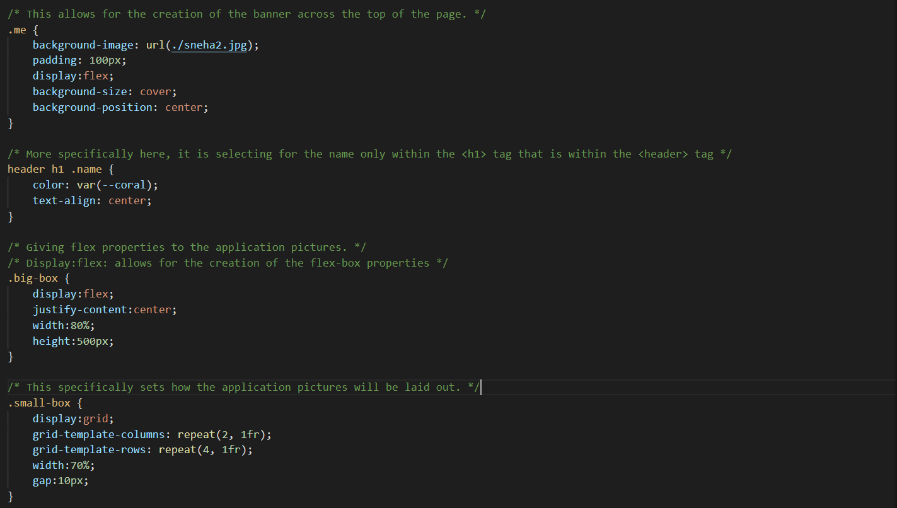
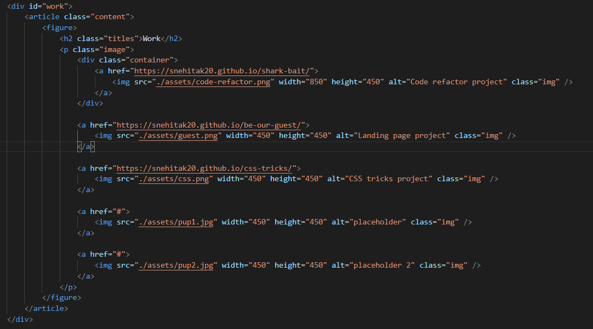

# infinity-and-beyond

## Description
The goal of this project is to ultimately have a webpage that is dedicated to an aspiring developer's portfolio. The portfolio showcases samples of their work, will contain the developer's name, and a recent photo. There will also be links to sections about them, their work, and contact information. When the link is clicked, it will scroll to the corresponding section. Their work will contain a section with titled images of their application. When the image of the application is clicked, it will open to the deployed application. To view th page on various screens, there will be a responsive layout that adapts to the viewport. 

For this project, the main objective was to build a deployed portfolio page from scratch. As such, the use of the `<meta name="viewport" content="width=device-width, initial-scale=1.0 />` was used to allow for a responsive layout when viewed on various screens. Tags such as `<section>, <article>, <footer>, <header>, <figure>` were used to replace `
` tags, and helped to create a logical and semantic structure. For images, accessible alt attributes were written. In order for images to open to the deployed link, the `` was placed within the ``. In the style.css file, the major change was utilizing `@media screen` to create the adaptive layout. The `.content` within the CSS file is important as it helped define the layout of the portfolio page: the borders of each of the sections, the use of the `flex-direction` to create rows, the use of `justify-content` in order to distribute space, and `display: flex` to create flex content. In the style.css file, common selectors and properties were consolidated under new names, and organized so the file will follow semantic structure.Comments were written to indicate the various changes to the CSS file, and to explain the CSS properties and their functions that were used for this project. 

[Link to webpage](https://snehitak20.github.io/infinity-and-beyond/)

## Installation

To complete a project like this, follow these steps. 

1. Create a new repository on Github. 
    - Press the "+" sign on the top right hand corner, or the "new" button on your GitHub homepage. 
    - Create an unique name for your repository, and make the respository public. 
    - Click the "README" option to include the "README" page. 
    - Your new repository has been created.
2. Open GitBash (PC users) or Terminal (Mac users).
    - Navigate to where you want to clone your new repository onto your local machine. 
        - Use `cd` to help you navigate. 
3. To clone the new repository onto your local machine. 
    - Click the respository that you just made on github.com.
    - Click the "code" button and choose the SSH option. 
    - Copy the SSH option to your clipboard. 
    - On GitBash/Terminal, enter the command `git clone git@github.com:<UserNAME>/<demo-repo>.git`
        - After `git clone`, paste the SSH option from your clipboard into GitBash/Terminal.
        - Since the SSH option was used, enter the password for the SSH key when asked. 
4. You have now cloned your new repository.
    - Using `cd`, navigate into your new repository from the location that you have saved it in. 
    - Use `ls` to see what is inside the new repository currently. 
        - It should only include the README page as of now.
5. Tranferring the project files into your new directory on your local machine. 
    - Using Finder/Explorer, copy the corresponding files that are needed to edit your project. 
    - In another Finder/Explorer window, navigate to your new repository, and paste the files directly into that folder. 
6. On GitBash/Terminal, after pasting the project files into the new repository. 
    - Use `ls` to see what is now inside the new repository.
        - This should now include the README page, and the project files that you have copy-pasted in. 
7. Use `git status` to see if there any changes that need to be made to the repository. 
    - At this point, git will tell you that there is an untracked file .
8. Use `git add .` to add the new project files, and allow the new files to be tracked by git.
9. Use `git commit -m "add base project files"` to commit the changes have recently been made to the repository. 
10. Use `git push origin main` to sync your local machine with GitHub. 
    - Enter your SSH password when prompted. 
11. Use `code .` to open the files on a code reader of your choice.
12. Edit the files as necessary in your code reader. 
13. Periodically, and when you are finished with editing your code: 
    - Follow Steps 7-10 to keep your repository up to date with the changes that have been made. 
14. How to deploy the webpage:
    - After one final push to the repository, direct yourself to the repository's settings. 
    - Click the "pages" option from the sidebar. 
    - Select "main branch" as the source, and check that it selected for the "root" option. 
    - Click "Save" to deploy your webpage. 
    - *Give 5-10 minutes for the webpage to display the full contents.
15. You have successfully completed this project!

## Usage

To navigate this webpage, click one of the links in the navigation bar that will lead you to the appropriate area of the website.
To access a previously deployed application, click an image, which will lead you to the deployed page. 

## Credits

The initial ask was given by the UC Berkeley Extension, Coding Bootcamp. 

## Reflection

For this project, it was important to understand advanced CSS properties such as media queries. To create a logical structure in the HTML file, it was important to know which HTML semantics were most appropriate to use. This project stands out as it is a professional portfolio for employers to use.

## License

Licensed under the [MIT](https://choosealicense.com/licenses/mit/) license. 